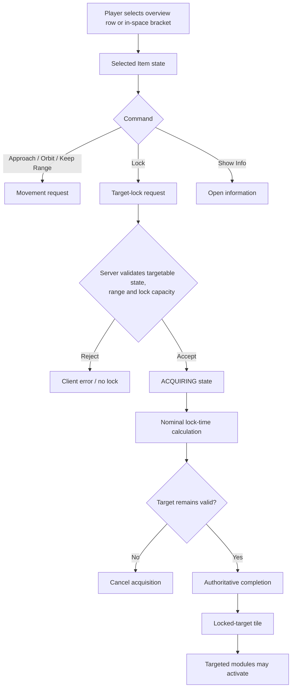
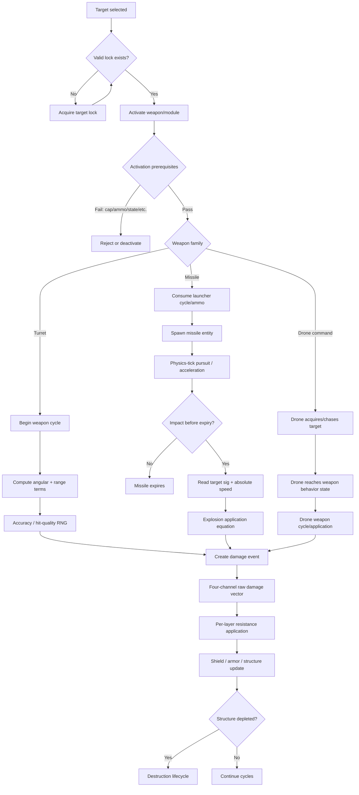
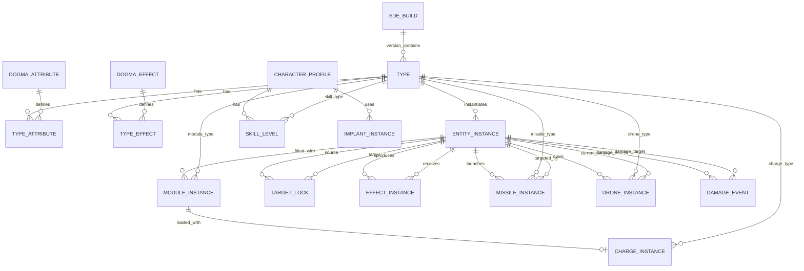

# EVE Online Combat Simulation Mechanics: Implementation-Ready Research Report

## Executive summary

A faithful EVE Online combat simulator should **not** be implemented as a conventional continuous-time rigid-body game with weapon “accuracy percentages” layered on top. The closest defensible model is a **hybrid authoritative simulation** with a one-second physics cadence, higher-frequency/event-driven non-physics systems, data-driven Dogma attribute modification, explicit entity state for missiles and drones, and client-side presentation/interpolation separated from authoritative state. CCP states that EVE's physics simulation runs at **1 Hz**, while non-physics interactions are processed as quickly as the server can handle them; simulation updates are distributed to clients in the relevant physics bubble/grid, and Time Dilation slows simulation when a node approaches processing limits. citeturn8search2turn8search0

The simulator's static database should be generated from the **Static Data Export (SDE)** rather than from manually maintained tables. CCP defines Dogma as the system of attributes and effects governing items; attributes and effects are represented in the SDE and through ESI's Dogma endpoints. CCP's 2025 SDE redesign was deliberately not backward compatible, removed or reorganized several legacy datasets, added files such as `dogmaUnits` and `dynamicItemAttributes`, and explicitly notes that some data used internally by the client/server is not exported. That last point is critical: **the public SDE describes much of the state and metadata, but it is not a dump of EVE's proprietary runtime Dogma or Destiny server code.** citeturn3view2turn3view3turn13search0

For combat, the central mathematical distinctions are:

| System | Primary application variables | Stochastic? | Travel time? | Key implementation rule |
|---|---|---:|---:|---|
| Turrets | Angular velocity, target signature radius, tracking, optimal, falloff | Yes | Effectively no projectile flight model | One random roll determines both whether a shot hits and its normal hit quality; wrecking hits are a special 1% region. citeturn4view2turn3view1 |
| Standard missiles | Target **absolute speed**, target signature radius, explosion radius, explosion velocity, DRF | No hit roll once impact occurs | Yes | A guided missile must physically survive long enough to reach its target; application is computed at impact. citeturn17view2turn18view2 |
| Combat drones | Drone position/motion plus turret-like weapon attributes | Usually turret-style for combat drones | Drone travel time | Treat each drone as an independent mobile combat entity, not as bonus DPS attached to its owner. CCP has repeatedly balanced drone tracking, orbit and optimal ranges as actual drone attributes. citeturn9search1turn9search12turn9search16 |
| Sentry drones | Stationary drone plus turret-like attributes | Yes | No drone travel after deployment | Stationary weapon platform; target still has relative angular motion. citeturn9search6 |
| Entropic Disintegrators | Turret/range mechanics plus spool state | Yes / turret-derived | No | Damage ramps on uninterrupted cycles, with a maximum spool bonus; they have special range behavior. citeturn9search27 |
| Vorton projectors | Special chained weapon with missile-like application attributes | Special | Special | Do not force into ordinary turret or missile classes; published DRFs differ by projector size. citeturn17view2 |

For turrets, the empirically established current formula is

\[
P_\text{hit}
=
0.5^{
\left(
\frac{\omega\,40000}{T\,S}
\right)^2
+
\left(
\frac{\max(0,d-O)}{F}
\right)^2
}
\]

where \(\omega\) is relative angular velocity in radians/s, \(T\) is turret tracking, \(S\) is target signature radius, \(d\) is range, \(O\) is optimal range, and \(F\) is falloff. The shot's random roll also determines ordinary hit quality, so expected turret DPS is **not simply paper DPS multiplied by hit probability**. citeturn4view2turn3view1

For missiles, the established application equation is

\[
D_\text{applied-before-resist}
=
D
\min
\left[
1,\;
\frac{S}{E},\;
\left(
\frac{S V_e}{E V_t}
\right)^\mathrm{DRF}
\right]
\]

where \(D\) is modified warhead damage, \(S\) target signature, \(E\) explosion radius, \(V_e\) explosion velocity, \(V_t\) the target's **absolute** speed and DRF the missile's hidden damage-reduction factor published in CCP data. Missiles therefore have no turret-style “tracking speed”: their analogous application problem is governed by explosion radius/velocity, target signature and target speed. citeturn17view2

Target locking is officially documented by CCP as depending on the attacker's **scan resolution** and target's **signature radius**. The widely tested, community-derived formula is

\[
t_\text{lock}
=
\frac{40000}
{R_\text{scan}\,[\operatorname{asinh}(S)]^2}
\]

in seconds. CCP does not publish that exact equation in the support article, so a high-fidelity implementation should classify it as an **empirically validated formula rather than an official code disclosure**. citeturn17view1turn20search0

A faithful modifier engine is at least as important as the individual weapon equations. EVE does not simply sum bonuses. Stacking-penalized percentage modifiers are ordered by strength and receive approximately **100%, 86.9%, 57.1%, 28.3%, 10.6%, 3.0%...** effectiveness. The community-derived exact weighting is

\[
S(u)=e^{-(u/2.67)^2}
\]

for the \(n\)th modifier with \(u=n-1\). CCP's own support documentation confirms the first five effectiveness values and that strongest modifiers apply first. Skills, implants and ship bonuses generally do not receive this stacking penalty; modules, rigs, command-burst effects and many environmental effects often do. citeturn18view0turn18view1

The largest unavoidable fidelity gaps are proprietary. Public sources do **not** expose the exact Destiny steering/collision implementation, complete server event ordering inside every scheduling interval, RNG implementation/seeding, all Dogma effect execution code, missile acceleration/guidance internals, every drone AI transition, or the exact client prediction/interpolation implementation. CCP's SDE documentation expressly warns that some fields are not exported. These areas should therefore be isolated behind replaceable policies and validated empirically against Tranquility rather than embedded as assumed truths. citeturn3view3turn8search2

## Data foundation and simulation architecture

**The SDE should be the simulator's schema seed, not a reference document copied by hand.** CCP's developer glossary distinguishes a Type from an Item instance, and organizes types into Groups, Categories, Meta Groups and Market Groups. It separately defines Attributes, Effects and Dogma; attributes are exposed through SDE Dogma data and ESI `/dogma/attributes/`, while effects are represented through SDE Dogma effects and ESI `/dogma/effects/`. citeturn3view2turn13search1

CCP's September 2025 SDE rework matters for any new implementation. The rework was explicitly not backward compatible; legacy BSD files were removed, universe data was reorganized into the map data, type bonuses/masteries were separated, new data collections were introduced, and JSON Lines became available alongside YAML. CCP also cautions that data the client itself does not export may not exist in the public dataset. A simulator intended to survive EVE patches should consequently version its importer separately from its combat engine and retain the exact SDE build/hash used for every simulation. citeturn3view3

A recent illustration of why version-pinning matters is CCP's 2026 balance work: Version 23.02 contains ship bonuses that directly modify missile velocity, explosion radius and explosion velocity. Those are formula inputs, not cosmetic stats, so silently mixing an old SDE with a new combat model produces materially wrong results. citeturn2search9turn16search9

**Recommended source-of-truth hierarchy**

| Priority | Source | Use |
|---|---|---|
| A | CCP SDE / developer documentation | Type IDs, Dogma attributes/effects, static bonuses, mass, signature, weapon attributes, missile attributes, module metadata. citeturn3view2turn3view3 |
| A | CCP patch/expansion notes | Version deltas, special-case behavior, balance changes and newly introduced mechanics. citeturn16search9turn16search5 |
| A | CCP Support / official feature documentation | Player-visible invariants such as lock dependencies, warp thresholds, damage channels and stacking rules. citeturn17view1turn15search4turn16search1turn18view0 |
| A/B | CCP technical/dev blogs | Server tick architecture, physics bubbles, Time Dilation, implementation constraints. citeturn8search2 |
| B | EVE University experimentally derived mechanics | Exact formulas CCP does not publish, particularly turret RNG, missile application, acceleration, capacitor recharge and detailed stacking behavior. citeturn4view2turn17view2turn8search1turn22search0 |
| C | EVE forums / reproducible player experiments | Lock formula/tick-boundary behavior and edge cases not present in official documentation. Treat as tests to reproduce, not axioms. citeturn20search0 |

**Authoritative scheduling model.** CCP describes EVE's physics simulation as operating once per second. A physics frame for a bubble is then fanned out to relevant clients. Importantly, CCP says **non-physics interactions do not all wait for that one-second physics loop**: they are processed as rapidly as possible by the server's Python execution. citeturn8search2

That makes a hybrid model preferable to a universal fixed timestep:

```text
simulation_clock
    ├── physics scheduler       -> authoritative Δt ≈ 1 s frames
    │      positions
    │      velocities
    │      collision/steering
    │      missile guidance/position
    │      bubble membership
    │
    ├── event scheduler         -> arbitrary timestamps / server ordering
    │      module cycle boundaries
    │      capacitor charges
    │      reload completion
    │      lock completion
    │      damage events
    │      ECM rolls
    │      drone commands
    │
    └── presentation clock      -> client-only
           interpolation
           camera
           particle/beam effects
           UI countdowns
           audio/notifications
```

A simulator that rounds **every** module cycle and every state transition to one-second boundaries would contradict CCP's statement about non-physics processing. Conversely, a simulator that integrates movement at 60 or 120 Hz as authoritative state would miss the physics quantization CCP explicitly describes. citeturn8search2

Locking and warp interception require particular care. Community testing observes one-second boundary effects in practical lock/warp races, even though the nominal lock equation produces fractional seconds. That should be implemented as a calibratable scheduling rule, because CCP's public server discussion does not reveal exactly where targeting completion sits relative to Destiny's physics frame and Dogma/event processing. citeturn20search0turn8search2

**Time Dilation.** In heavily loaded systems EVE slows simulation rather than allowing the server to fall indefinitely behind. For a battle simulator, introduce a `simulationTimeScale` separate from wall clock. Movement, module cycles and other game-time durations should be expressed in simulation time; UI can render the corresponding stretched wall-clock durations. CCP's server engineering description makes clear that TiDi is a server-load response and part of real EVE execution, not merely a visual client effect. citeturn8search2

**ESI versus runtime state.** ESI is CCP's official REST interface, whereas the SDE contains static game data. ESI is useful for importing character/fitting-related information that its endpoints expose, but an implementation should not architect ESI as a live combat-physics stream. That is an architectural inference from CCP's separation of ESI/SDE and the authoritative server simulation: the local simulator should own its instantaneous position, missile, lock and cycle states. citeturn3view2turn13search0

## Physics, movement and spatial mathematics

EVE sub-warp movement is notably **not ordinary constant-acceleration Newtonian movement**. Community measurements model acceleration toward maximum velocity exponentially as

\[
V(t)
=
V_\max
\left(
1-e^{-t\,10^6/(I M)}
\right)
\]

for acceleration from rest, where \(M\) is mass in kilograms and \(I\) is the inertia modifier. Rearranging gives the time to reach a fraction \(f=V/V_\max\):

\[
t(f)
=
-I M\,10^{-6}\ln(1-f)
\]

This formula is empirically derived rather than published as Destiny source code, but it reproduces EVE's displayed alignment behavior and is widely used for fitting calculations. citeturn8search1

CCP's official warp documentation states that a ship must be aligned toward its destination and reach at least **75% of its current maximum velocity** to enter warp. citeturn15search4 Setting \(f=0.75\) in the empirical velocity equation gives

\[
t_\text{align,rest}
=
-I M\,10^{-6}\ln(0.25)
=
1.386294361\,\frac{I M}{10^6}.
\]

For a hypothetical ship with \(M=1.2\times10^6\) kg and \(I=3.0\),

\[
t_\text{align}
=
1.386294361
\frac{3.0(1.2\times10^6)}{10^6}
\approx 4.99\text{ s}.
\]

This is a **continuous nominal value**. Actual command/physics boundary behavior needs to be tested in the 1 Hz server model rather than implemented as “warp precisely at 4.99 s.” citeturn8search2turn8search1

CCP's warp guide also states that the normal minimum distance for initiating a warp is 150 km, and that target locks persist while a ship is merely aligning; locks break once it has actually entered warp. A warp scramble applied during alignment cancels the warp attempt. citeturn15search4

**Propulsion modules change more than speed.** Current EVE University documentation records that afterburners and microwarpdrives increase maximum velocity and acceleration but add effective mass while active. MWDs additionally impose a very large signature-radius penalty, reduce capacitor capacity when fitted, use substantial capacitor and can be shut down by warp scramblers. Thus propulsion state must feed at least four combat subsystems: movement, turret application, missile application and target locking. citeturn20search1

Do not model an MWD as simply:

```text
velocity *= 5
```

Instead expose source attributes such as maximum-velocity bonus, module thrust/effective mass contribution, signature-radius multiplier, capacitor cost and scram-disable state to the Dogma modifier layer. EVE propulsion has several module sizes and faction/deadspace variants, so current values should be loaded from SDE rather than encoded as one universal multiplier. citeturn20search1turn22search12

**Relative velocity geometry is central to turret combat.** Given shooter position \(\mathbf p_s\), target position \(\mathbf p_t\), shooter velocity \(\mathbf v_s\) and target velocity \(\mathbf v_t\),

\[
\mathbf r=\mathbf p_t-\mathbf p_s,
\qquad
\mathbf v_r=\mathbf v_t-\mathbf v_s.
\]

The range is

\[
d=\|\mathbf r\|.
\]

Relative transversal speed is the component of relative velocity perpendicular to the line of sight:

\[
v_\text{trans}
=
\frac{\|\mathbf r\times\mathbf v_r\|}{\|\mathbf r\|}.
\]

Angular velocity is therefore

\[
\omega
=
\frac{v_\text{trans}}{d}
=
\frac{\|\mathbf r\times\mathbf v_r\|}{\|\mathbf r\|^2}.
\]

EVE's turret equation consumes **angular velocity**, not raw transversal velocity. This means the same 300 m/s transversal is substantially easier to track at 30 km than at 3 km. The official/UI terminology exposes both kinds of movement information in relevant contexts, while the experimentally verified turret formula uses angular velocity. citeturn4view2turn15search3

Radial relative speed is useful for range-control AI:

\[
v_\text{radial}
=
\frac{\mathbf r\cdot\mathbf v_r}{\|\mathbf r\|},
\]

with positive/negative sign convention chosen consistently by the simulator. Orbit and keep-at-range behaviors should be controllers that change the desired velocity vector; they should not teleport an entity onto a perfect mathematical circle.

**Signature radius is not physical collision radius.** It is a combat/sensor attribute. A larger signature makes a ship lock faster and causes worse weapon application against it; MWD use is one of the most important dynamic sources of signature bloom. citeturn17view1turn20search8turn20search1 A separate spatial `boundingRadius`/collision radius is therefore required in the data model.

Distance semantics also require an abstraction layer. Missile-mechanics testing notes that missile flight calculations and overview distances do not always use the same reference point: missile ranges have historically required compensation for center-versus-edge measurements on very large ships. Consequently store both center distance and an interaction/surface distance instead of assuming every subsystem uses one scalar. citeturn18view2

A useful spatial API is:

```text
centerDistance(a,b) =
    length(a.position - b.position)

surfaceDistance(a,b) =
    max(0,
        centerDistance(a,b)
        - a.collisionRadius
        - b.collisionRadius)
```

Then each effect declares which semantic it uses.

**Bumping/collision behavior should be replaceable.** CCP explicitly recognizes ship bumping as real gameplay rather than an exploit, but does not publicly provide Destiny's collision solver. citeturn15search8 For an implementation intended primarily for combat application analysis, spherical collision volumes and calibrated impulse/separation behavior are reasonable approximations, but they must be marked `empirical` rather than `canonical`.

**Capacitor is a required dependency even though it is not itself a weapon formula.** Weapons, propulsion, EWAR, repairers and many active resist modules can fail to cycle when capacitor is unavailable. Experimental work summarized by EVE University gives the instantaneous capacitor recharge equation

\[
\frac{dC}{dt}
=
\frac{10 C_\max}{T}
\left(
\sqrt{\frac{C}{C_\max}}
-
\frac{C}{C_\max}
\right),
\]

where \(C\) is current charge, \(C_\max\) maximum charge and \(T\) nominal recharge time. The curve peaks at 25% capacitor at 2.5 times average recharge. citeturn22search0

The peak follows directly by setting \(x=C/C_\max\):

\[
f(x)=\sqrt{x}-x,
\qquad
f'(x)=\frac{1}{2\sqrt{x}}-1=0,
\]

so \(\sqrt{x}=1/2\), hence \(x=1/4\). At \(x=.25\),

\[
10(\sqrt{.25}-.25)=10(.5-.25)=2.5.
\]

This should be integrated continuously or with a sufficiently accurate analytic/numerical update between event timestamps rather than approximated by a flat GJ/s value.

## Targeting, sensors and user-interface flows

CCP's official rule is straightforward: lock time is determined by the **locking ship's scan resolution** and the **target's signature radius**. Higher scan resolution means a faster lock; larger target signature means it is acquired faster. citeturn17view1

The accepted empirical equation is:

\[
\boxed{
t_\text{lock}
=
\frac{40000}
{R_\text{scan}\,[\operatorname{asinh}(S)]^2}
}
\]

where \(R_\text{scan}\) is scan resolution and \(S\) target signature radius. The formula is not printed in CCP's public support article, so it should carry an `empirical_formula` provenance flag in a rigorous simulator. Community calculations and long-standing tests reproduce in-game values using it. citeturn20search0turn17view1

For example, an attacker with 620 mm scan resolution locking a 40 m target has

\[
\operatorname{asinh}(40)\approx4.382,
\]

\[
t
=
\frac{40000}
{620(4.382)^2}
\approx3.36\text{ s}.
\]

Community observations additionally report that the actual result in a lock-versus-warp race can depend on server-tick boundaries. This is one of the areas where the nominal equation and authoritative scheduler must be kept separate. citeturn20search0turn8search2

A locking implementation needs at least:

```text
source.scanResolution
source.maxTargetRange
source.maxLockedTargetsFromHull
source.maxLockedTargetsFromCharacterAndModules

target.signatureRadius
target.targetableState

lock.requestedAt
lock.nominalCompletionAt
lock.authoritativeCompletionFrame
lock.state = REQUESTED | ACQUIRING | LOCKED | BROKEN
```

The effective number of simultaneous locks is constrained by both character/module capability and the ship's own target limit; contemporary ship data explicitly contains a “Max Locked Targets” attribute alongside scan resolution, target range, sensor strength and signature radius. citeturn22search3turn22search5turn22search7

**Sensor strength is different from scan resolution.** Scan resolution determines how quickly *you* acquire a target. Sensor strength primarily enters ECM resistance and related sensor mechanics. For example, current ship attribute records distinguish `Scan Res.` from racial sensor points. citeturn22search3turn22search5

For a single ECM jammer, the established probability is

\[
P_\text{jam}
=
\min\left(1,\frac{J}{S_\text{sensor}}\right),
\]

before accounting for range falloff, where \(J\) is the relevant ECM strength and \(S_\text{sensor}\) is the target's sensor strength. EVE University's current EWAR documentation records this ratio and notes that ECM strength loses effectiveness through falloff with the same falloff curve concept used by turrets. A successful jam breaks the target's existing locks except for permitted locks on the jammer and restricts reacquisition during the jam cycle. citeturn21search0turn22search2

For independent jammer attempts \(p_1,\ldots,p_n\), the probability that **at least one** succeeds is

\[
P_{\ge1}
=
1-\prod_{i=1}^{n}(1-p_i).
\]

Thus two independent jammers each having \(4/20=0.20\) chance give

\[
1-(1-.20)^2
=
1-.64
=
36\%.
\]

Do not add them to 40%; independent failure probabilities multiply.

ECM drones are a special implementation case. Current EVE University documentation gives them multispectral jam strength and records that successful ECM-drone jams last only five seconds despite the twenty-second attempt cycle, unlike normal ECM's standard twenty-second jam cycle. citeturn21search4

Other EWAR belongs in the same attribute engine rather than in weapon-specific code. Current EWAR comprises ECM, tracking/guidance disruption, remote sensor dampening and target painting; tackle and capacitor warfare add further combat control. citeturn22search2 Conceptually:

| Effect | Primary modified attributes | Consequence |
|---|---|---|
| Sensor dampener | Scan resolution and/or maximum target range | Slower future locks and possibly loss/inability of distant locks. citeturn21search0turn21search2 |
| Target painter | Signature radius | Faster acquisition and improved turret/missile application. citeturn20search8turn21search4 |
| Tracking disruptor | Turret tracking and range attributes | Reduces turret hit probability. citeturn22search2turn21search2 |
| Guidance disruptor | Missile application/range attributes | Alters missile damage/range performance rather than angular tracking. citeturn22search2turn21search2 |
| Stasis webifier | Maximum velocity | Changes movement and therefore both turret angular motion and missile speed application. citeturn21search4 |
| Warp scrambler | Warp capability; disables MWD behavior where applicable | Prevents warp and changes propulsion/application state. citeturn15search4turn20search1 |

**Faithful combat UI layout.** CCP's current Overview documentation says the Overview supports configurable tabs and filters, with up to 20 tabs, while items can have independently configured in-space bracket filters. EVE's common interaction pattern allows an object to be selected from the Overview, interacted with using a right-click or radial menu, and controlled through keyboard shortcuts. citeturn15search2turn15search3

The default control vocabulary includes `Approach`, `Orbit`, `Keep at Range`, `Lock target`, `Warp to` and related actions; contemporary key mappings document `Q`, `W`, `E`, `Ctrl`, and `S` respectively as defaults/commands in the relevant shortcut scheme. citeturn15search5

An implementation-oriented mockup preserving that interaction topology is:

```text
 ┌────────────────────── LOCKED TARGET STRIP ──────────────────────┐
 │ [Cruiser 22km] [Frigate 14km] [Drone 8km] ...                  │
 └──────────────────────────────────────────────────────────────────┘

 ┌─ SELECTED ITEM ─────────────────────────────────┐
 │ Frigate — 14.2 km — 1,840 m/s                  │
 │ [Approach] [Orbit] [Keep Range] [Lock] [Info] │
 └─────────────────────────────────────────────────┘

                  3-D SPACE / TACTICAL OVERLAY
                   range rings / brackets
              target vectors / weapon feedback

                                                ┌─ OVERVIEW ────────────────┐
                                                │ PvP | Drones | Fleet | + │
                                                │ Name  Dist  Vel  Ang...  │
                                                │ ▸ A     14k 1840 .031    │
                                                │   B     22k  410 .006    │
                                                │   C      8k 3200 .090    │
                                                └───────────────────────────┘

 ┌─ DRONES ───────────────┐
 │ In Bay      5          │
 │ In Space    5          │
 │ Hobgoblin II  fighting │
 └────────────────────────┘

                        ┌──── SHIP HUD ────┐
                        │ shield / armor   │
                        │ hull / capacitor │
                   speed│      ◉           │modules
                  [====]│ F1 F2 F3 F4 ... │[cycles]
                        └───────────────────┘
```

This is a **mockup**, not a pixel-copy of CCP's copyrighted interface. The topology is grounded in the current Overview/Selected Item/HUD interaction model: CCP support explicitly places actions in the Selected Item panel and Overview, and its fighter-control documentation describes the module rack as part of the central HUD. citeturn15search4turn15search0turn15search2

The selected object and the locked target are distinct states. Selecting an Overview row should not automatically grant a lock. Lock acquisition should produce an intermediate visual state, then create a locked-target tile only after authoritative completion. Beginner combat documentation describes this exact progression from Overview selection through target locking to a separate locked-target display. citeturn15search9



The precise server ordering represented by “authoritative completion” is deliberately abstract: the public sources identify lock dependencies but do not expose CCP's internal target-manager source code. citeturn17view1turn8search2

## Weapons, missiles, drones and combat application math

**Turret accuracy.** EVE's current empirically documented turret equation is

\[
P_\text{hit}
=
0.5^{A^2+R^2}
\]

with

\[
A
=
\frac{\omega\,40000}{T S}
\]

and

\[
R
=
\frac{\max(0,d-O)}{F}.
\]

Thus

\[
\boxed{
P_\text{hit}
=
0.5^{
\left(\frac{\omega\,40000}{TS}\right)^2+
\left(\frac{\max(0,d-O)}{F}\right)^2
}
}
\]

The formula and its random-hit-quality behavior have been extensively experimentally tested by EVE players and summarized by EVE University; CCP does not publish the corresponding server function. citeturn4view2turn19search3

Several important consequences follow directly.

Inside optimal, \(d\le O\), the range penalty is zero. If angular velocity is also zero, then

\[
P=0.5^0=1.
\]

At exactly optimal plus one falloff with no tracking penalty,

\[
R=1
\quad\Rightarrow\quad
P=0.5.
\]

At optimal plus two falloffs,

\[
R=2
\quad\Rightarrow\quad
P=0.5^4=0.0625.
\]

This is why falloff is not a hard cutoff. citeturn4view2

Signature enters only the tracking term. Consequently, when \(\omega=0\), changing target signature does not alter turret hit chance. That is an unintuitive but important implementation test. citeturn4view2

**Turret damage quality.** A single uniform random number \(x\in[0,1]\) is used both for hit success and normal damage quality in the experimentally established model. For an ordinary hit the multiplier is approximately

\[
M=x+0.49,
\]

while the low-end wrecking region produces a \(3\times\) damage hit. EVE University's current derivation models the first 1% of the random interval as wrecking. citeturn4view2

For \(P\ge0.01\), expected normalized damage per shot is therefore

\[
E[M]
=
\int_0^{0.01}3\,dx
+
\int_{0.01}^{P}(x+0.49)\,dx.
\]

Evaluating,

\[
E[M]
=
0.03+
\left[
\frac{x^2}{2}+0.49x
\right]_{0.01}^{P}
\]

\[
=
0.5P^2+0.49P+0.02505
\]

or

\[
\boxed{
E[M]=
\frac12(P^2+0.98P+0.0501)
}.
\]

For \(P<0.01\), all successful shots lie in the wrecking region, giving

\[
E[M]=3P.
\]

This matters enormously to analytical DPS. At one falloff, \(P=.5\), but

\[
E[M]
=
0.5(.25+.49+.0501)
=
0.39505.
\]

So the long-run applied damage is about **39.5% of base normalized shot damage**, not 50%, before resistances. citeturn4view2

Consider an engagement where the normalized tracking term is \(A=0.5\) and range is exactly one falloff beyond optimal, \(R=1\):

\[
P=0.5^{0.25+1}
=0.5^{1.25}
\approx0.42045.
\]

Then

\[
E[M]
\approx
0.5(0.42045^2+0.98(0.42045)+0.0501)
\approx0.31946.
\]

The simulator should therefore distinguish:

```text
paperVolley
nominalHitProbability
expectedPreResistVolley
realizedRandomVolley
postResistAppliedDamage
```

rather than storing one ambiguous `damage` figure.

**Missile mechanics.** Standard missiles replace turret tracking with guided flight plus explosion application. CCP's Quantum Rise balancing notes explicitly describe the principle that target signature and speed reduce damage from oversized missiles; later CCP patch notes state that the missile damage equation's internal DRF calculation was simplified computationally without changing gameplay. citeturn16search3turn16search5

The modern empirical equation is

\[
\boxed{
D_\text{impact}
=
D
\min
\left(
1,\frac{S}{E},
\left[
\frac{S V_e}{E V_t}
\right]^\mathrm{DRF}
\right)
}
\]

with the following meanings. citeturn17view2

| Variable | Meaning | Better for attacker |
|---|---|---|
| \(D\) | Modified base/warhead damage | Higher |
| \(S\) | Target signature radius | Higher |
| \(E\) | Missile explosion radius | Lower |
| \(V_e\) | Explosion velocity | Higher |
| \(V_t\) | Target's absolute velocity at impact | Lower |
| DRF | Damage-reduction factor | Generally lower gives gentler velocity-related reduction |

A standard missile does **not** use transversal or angular velocity in this equation. The target can orbit the launcher at high angular velocity yet still suffer good missile application if its absolute speed is low enough; conversely, a target moving quickly in a straight line can reduce missile damage even with nearly zero angular motion. citeturn17view2

The \(\min(1,\ldots)\) term caps application at 100% of the modified warhead damage. The signature term alone is

\[
f_\text{sig}=\frac{S}{E}.
\]

A stationary 40 m target struck by a missile with a 140 m explosion radius therefore cannot exceed

\[
40/140\approx28.6\%
\]

application from that term alone.

The speed term becomes less than one once

\[
\frac{S V_e}{E V_t}<1.
\]

Solving the equality for the threshold speed gives

\[
\boxed{
V_t=S\frac{V_e}{E}
}.
\]

This is a useful precomputed “minimum velocity factor”:

\[
MVF=\frac{V_e}{E}.
\]

EVE University's missile analysis derives the same threshold. citeturn17view2

For a numerical example, take an illustrative missile with

\[
D=150,\quad
E=140\text{ m},\quad
V_e=85\text{ m/s},\quad
DRF=.682
\]

against a 50 m-signature target moving 500 m/s.

Signature term:

\[
\frac{S}{E}
=
\frac{50}{140}
=
0.35714.
\]

Velocity term:

\[
\left(
\frac{50(85)}
{140(500)}
\right)^{.682}
=
(0.060714)^{.682}
\approx0.14798.
\]

Therefore

\[
f_\text{application}
=
\min(1,.35714,.14798)
=.14798
\]

and

\[
D_\text{impact}
=
150(.14798)
\approx22.20.
\]

If that entire warhead is kinetic and the applicable defensive layer has 60% kinetic resistance, post-resist damage is

\[
22.20(1-.60)
\approx8.88.
\]

This shows why **warhead application and resistance are separate stages**.

The hidden DRF varies by missile class and ammunition. The current EVE University compilation, sourced from CCP-published game data, includes representative values such as: citeturn17view2

| Missile/ammunition class | DRF |
|---|---:|
| Precision Light Missile | 0.561 |
| Light Missile | 0.604 |
| Rocket | 0.644 |
| Heavy Missile | 0.682 |
| Fury Light Missile | 0.682 |
| Precision Cruise Missile | 0.735 |
| Cruise Missile | 0.882 |
| Heavy Assault Missile | 0.882 |
| Fury Heavy Missile | 0.882 |
| Javelin HAM | 0.895 |
| Fury Cruise Missile | 0.908 |
| Rage HAM | 0.920 |
| Torpedo | 0.944 |
| Javelin/Rage Torpedo | 0.967 |
| XL Torpedo | 1.000 |
| Small Vorton Projector | 0.40 |
| Medium Vorton Projector | 0.50 |
| Large Vorton Projector | 0.70 |

These values should still be imported from the versioned SDE rather than frozen into application code.

Illustrative base missile attributes recorded by the same mechanics reference demonstrate the size/application progression: regular light missiles around 40 m explosion radius versus heavy missiles around 140 m and torpedoes around 405 m in the cited dataset, with corresponding changes in explosion velocity. Exact live ammunition numbers are patchable data and should be read from SDE. citeturn17view2

**Explosion radius is not an ordinary blast-radius/AoE circle.** For standard guided missiles it is a **damage-application attribute** in the equation above. The missile has one intended target; ordinary missile damage should not be applied to every entity whose physical position falls within `explosionRadius`. Separate AoE systems such as smartbombs, bombs and special chained weapons require separate effect classes. Signature-radius documentation explicitly distinguishes bombs and smartbombs from ordinary missile/turret behavior. citeturn20search8

**Missile flight.** A missile leaves its launcher, accelerates toward its best speed, continually steers toward the target and disappears if its flight-time/fuel budget expires before interception. A common first-order estimate is

\[
R_\text{nominal}
\approx
V_\text{max}T_\text{flight}.
\]

EVE University explicitly describes that product as an approximation because the missile accelerates and because EVE physics runs in one-second intervals. Target motion matters: a target flying away may cause the missile to run out of fuel, while a target flying toward the missile may be intercepted even when initially outside the simple nominal distance. citeturn18view2

For example,

\[
V_\text{max}=3750\text{ m/s},\quad
T=5\text{ s}
\]

gives

\[
R_\text{nominal}=18\,750\text{ m}.
\]

That is not a guaranteed engagement-radius sphere.

Community testing additionally reports stochastic-looking whole-tick behavior when missile flight time is fractional; a cited example is 7.5 s producing roughly 7- or 8-second lifetimes. Because CCP does not expose the underlying timer source, implement this behind a `MissileLifetimePolicy` and verify current Tranquility behavior before treating it as permanent. citeturn18view2

The exact missile **acceleration curve, guidance constants and steering algorithm are not publicly specified**. Public documentation supports “quickly accelerates then flies at best speed and follows the target,” but not a source-code-accurate differential equation. citeturn18view2turn3view3 A sound design is therefore:

```text
MissileFlightModel interface
    stepAuthoritativePhysics(missile, target, dt)
    hasIntercepted(...)
    hasExpired(...)

Implementations:
    ApproximateDirectPursuit
    EmpiricallyCalibratedDestinyLike
```

Keep the missile's physical `velocity` distinct from `explosionVelocity`; they are entirely different quantities. The first controls travel, the second damage application. citeturn17view2

**Drones.** Drones must exist as entities with their own position, velocity, signature/HP where relevant, targeting state, orbit/chase controller and weapon state. CCP has explicitly changed combat-drone orbit ranges, attack ranges, tracking and optimal values in balance passes, proving these are independent mechanical properties rather than merely owner-level DPS modifiers. citeturn9search1turn9search12

Combat-drone upgrades likewise modify actual weapon attributes. Current drone documentation lists Omnidirectional Tracking modules as improving drone tracking and optimal/falloff, while CCP ship bonuses continue to grant percentage bonuses to drone tracking. citeturn14search25turn9search16

Sentries should be modeled as essentially stationary weapon platforms after deployment. Heavy/medium/light combat drones need chase-to-orbit transitions and can lose application because their own movement changes relative angular velocity. Exact autonomous aggro rules have changed over EVE's history and are not fully specified as a public server state machine, so owner commands such as `engage`, `return`, `orbit`, `assist` and `guard` should be explicit, while uncommanded AI behavior is kept configurable.

Drone control range also belongs in the effect/data system rather than being baked into their weapon range. Current documentation identifies Drone Link Augmentors as adding absolute control range and specifically notes that this absolute range increase is not stacking penalized. citeturn14search25turn18view0

**Special weapons.** Entropic Disintegrators should carry a per-target/per-weapon continuous-cycle spool counter: CCP's Into the Abyss documentation introduced a maximum +150% damage spool and special no-falloff/out-of-optimal behavior. Breaking the firing chain resets the special state according to the weapon's rules rather than treating each shot as an unrelated turret volley. citeturn9search27 Vorton projectors likewise deserve their own application class because the published data include projector-specific DRFs and the weapon's chained behavior is not equivalent to a conventional launcher. citeturn17view2

The recommended firing state machine is:



The broad sequencing is mechanically grounded; exact internal ordering of resource consumption, damage-event publication and client notification inside the server implementation remains proprietary and should be verified with combat logs where sub-tick ordering matters. citeturn3view3turn8search2

## Damage, resistances, stacking, modules, skills and implants

EVE uses four canonical damage channels: **EM, Thermal, Kinetic and Explosive**. CCP states that ammunition can contain one or multiple damage types and that each component is resisted independently by the corresponding resistance of the defensive layer. citeturn16search1

The natural representation is therefore a vector:

\[
\mathbf D
=
\begin{bmatrix}
D_{EM}\\
D_{TH}\\
D_{KIN}\\
D_{EXP}
\end{bmatrix}
\]

and, for a particular defensive layer,

\[
\mathbf R
=
\begin{bmatrix}
R_{EM}\\
R_{TH}\\
R_{KIN}\\
R_{EXP}
\end{bmatrix}.
\]

Effective damage to that layer before overflow is

\[
D_\text{layer}
=
\sum_k D_k(1-R_k).
\]

For example, a volley containing 100 thermal and 100 kinetic damage against 20% thermal and 60% kinetic resistances produces

\[
100(.8)+100(.4)=120
\]

effective HP loss on that layer.

The ordinary defensive hierarchy is shield, then armor, then structure/hull. There is a historical/current shield-penetration edge mechanic associated with **Tactical Shield Manipulation** when shields are low; CCP patch notes explicitly record that the skill was fixed to prevent bleed-through according to its description, and current tanking documentation still identifies the skill as reducing damage bleed to armor through shields. citeturn19search9turn19search2 Because public sources do not specify every detail of mixed-damage intra-volley overflow, that exact edge should be made a conformance test rather than guessed.

A robust damage routine should carry **raw remaining damage by channel**, not merely convert the whole volley to an undifferentiated post-resist number and then transfer surplus HP loss between layers. Different shield and armor resist profiles mean overflow must be capable of being recomputed against the next layer.

A suitable abstract algorithm is:

```text
raw = weaponDamageVector * applicationMultiplier

for layer in [shield, armor, structure]:
    if raw is zero:
        break

    effectivePerChannel[k] = raw[k] * (1 - layer.resist[k])
    totalEffective = sum(effectivePerChannel)

    if totalEffective <= layer.hp:
        layer.hp -= totalEffective
        raw = zero
    else:
        # Determine the fraction of the original incoming vector
        # consumed while exhausting this layer, then pass the
        # remaining raw fractions to the next resistance profile.
        consumedFraction = layer.hp / totalEffective
        raw *= (1 - consumedFraction)
        layer.hp = 0

applyLowShieldBleedthroughPolicyIfApplicable(...)
```

The proportional-overflow step is the logical implementation of per-channel resistance with changing layers, but the exact server implementation is not publicly disclosed. Treat mixed-resistance boundary-volley tests as mandatory empirical validation.

**Resistance bonuses combine multiplicatively on remaining vulnerability.** With base resistance \(R_0\) and effective resistance modifiers \(r_i\),

\[
\boxed{
R_\text{final}
=
1-
(1-R_0)
\prod_i(1-r_i)
}.
\]

With stacking penalties included, the currently documented form is exemplified by

\[
R
=
1-(1-R_0)
(1-r_1)
(1-0.869r_2)
(1-0.571r_3)
(1-0.283r_4)\ldots
\]

after sorting the relevant modifiers from strongest to weakest. citeturn14search7turn18view0

Suppose a layer begins at 20% resistance and receives nominal 30%, 25%, and 20% stacking-penalized resist bonuses. Then:

\[
R=
1
-(.8)
(1-.30)
(1-.25(.869))
(1-.20(.571))
\]

\[
R\approx0.61172.
\]

The result is about **61.17% resistance**, not \(20+30+25+20=95\%\).

**General stacking penalty.** If sorted modifiers have nominal fractional effects \(m_1,m_2,\ldots\), use

\[
w_n=e^{-((n-1)/2.67)^2}
\]

and replace each modifier by its effective strength \(m_nw_n\) before multiplicative aggregation where that attribute uses ordinary stacking penalties. citeturn17view3

Rounded values are:

| Rank | Effectiveness |
|---:|---:|
| 1 | 100.0% |
| 2 | 86.9% |
| 3 | 57.1% |
| 4 | 28.3% |
| 5 | 10.6% |
| 6 | ≈3.0% |

CCP officially confirms the first through fifth values and that fitting order is irrelevant—the strongest modifier receives first position. citeturn18view0

Stacking is **attribute/effect-specific**, not simply “all modules of the same type.” EVE University's detailed current analysis notes, for example, that signature radius, scan resolution, targeting range, sensor strength, turret tracking, turret optimal/falloff, missile damage, explosion radius, explosion velocity, missile velocity and missile flight time can be stacking-penalized when modified by relevant module/rig effects, while absolute drone control range is not. citeturn18view1turn21search2

It also records that positive and negative modifier groups are handled separately in stacking order. Skills, ship-skill bonuses and implants generally do **not** consume stacking-penalty slots, while modules/rigs and many command/environmental effects do. citeturn18view1 CCP independently states that command-burst effects modifying the same attribute as modules can be subject to stacking penalties, and duplicate command bursts of the same charge type do not simply stack—the strongest relevant effect applies. citeturn16search12

There are exceptions. Damage Control, Reactive Armor Hardener and Bastion resistance interactions have special treatment, making it unsafe to implement one universal “sort every percentage and call `stackWeight(n)`” routine. citeturn18view1 The data model should support `stackingGroup`, `stackingExempt`, and an optional custom aggregation policy.

**Core module families affecting combat math**

| Module/effect family | Attributes modified | Systems affected |
|---|---|---|
| Tracking Computer / Enhancer / remote tracking effects | Tracking, optimal, falloff | Turret and drone-turret accuracy. Stacking rules apply to the modified stats. citeturn18view1turn14search25 |
| Guidance Computer / Enhancer | Missile application/range attributes | Explosion radius/velocity, flight/range-related values depending on script/effect. citeturn17view2turn21search2 |
| Ballistic Control System | Missile damage and launcher rate | Raw missile DPS before application; subject to relevant stacking rules. citeturn17view2turn21search2 |
| Turret damage upgrade modules | Damage multiplier and rate of fire | Turret volley/DPS before hit application. citeturn18view1 |
| Target Painter | Target signature radius | Lock time, turret tracking term and missile application. citeturn20search8turn21search4 |
| Web / Grappler | Target velocity | Movement, missile application and resulting angular/range control. citeturn21search4turn21search2 |
| Sensor Booster / Signal Amplifier / Remote Sensor Booster | Scan resolution and/or target range | Lock time/range. citeturn17view1turn20search6 |
| Sensor Dampener | Enemy scan resolution/range | Lock acquisition and range. citeturn22search2turn21search2 |
| ECM | Jam strength | Probabilistic lock disruption against sensor strength. citeturn21search0 |
| AB/MWD | Max velocity, effective mass; MWD signature/cap effects | Physics and all speed/signature-dependent application. citeturn20search1 |
| Resist modules | Per-layer per-channel resistance | Post-application damage reduction. citeturn16search1turn14search7 |
| Command bursts | Various fleet attributes | Time-limited AoE modifier instances with special duplicate/stacking rules. citeturn16search12 |

**Turret-support skills** should be represented as ordinary Dogma-derived character modifiers rather than special cases in the hit formula itself. Current skill documentation gives the following important families. citeturn14search2turn14search17

| Skill | Principal effect per level |
|---|---|
| Gunnery | 2% faster turret firing / corresponding cycle-time improvement |
| Motion Prediction | +5% turret tracking |
| Rapid Firing | 4% faster firing |
| Sharpshooter | +5% optimal range |
| Surgical Strike | +3% turret damage |
| Trajectory Analysis | Increased turret falloff |
| Controlled Bursts | −5% capacitor need for capacitor-using turrets |

These effects belong upstream of the hit equation. For example, Motion Prediction modifies \(T\); Sharpshooter modifies \(O\); Trajectory Analysis modifies \(F\); Surgical Strike modifies raw \(D\); Rapid Firing changes cycle duration.

The distinction between a percentage decrease in cycle time and a same-sized increase in DPS is important. A 20% cycle-time reduction gives

\[
\frac{1}{0.8}=1.25
\]

or 25% more cycles per unit time.

**Missile support skills** likewise alter equation inputs rather than adding an arbitrary “missile skill multiplier.” Current descriptions include: citeturn14search3turn14search6

| Skill | Principal effect |
|---|---|
| Missile Bombardment | +10% missile flight time per level |
| Missile Projection | +10% maximum missile velocity per level |
| Guided Missile Precision | −5% signature-radius factor for missile explosions per level |
| Target Navigation Prediction | −10% target-velocity factor for missile application per level |
| Warhead Upgrades | Increased missile damage |
| Missile Launcher Operation / Rapid Launch families | Launcher firing-rate improvements |

Guided Missile Precision and Target Navigation Prediction should be applied according to their actual Dogma effects rather than rewritten casually as “tracking.” The player-facing wording describes altered signature and target-velocity factors, while simulator implementation should use the exact SDE modifier target. citeturn14search3turn17view2

**Targeting skills** similarly alter derived targeting attributes. Contemporary sources identify Signature Analysis as improving locking performance through scan resolution, Long Range Targeting as extending lock range, and Target Management/Advanced Target Management as increasing simultaneous target capability subject to the hull's maximum. citeturn9search26turn20search6

**Implants should be loaded exactly like another modifier source.** Missile hardwirings include “Snapshot” families affecting specific missile damage and “Deadeye” families affecting missile signature/target-navigation factors; the current missile-mechanics reference records grades in the roughly 1–6% range depending on implant. citeturn17view2 CCP's Hydra implant-set announcement is a useful demonstration of cross-system effects: Hydra bonuses include drone tracking/optimal/falloff together with missile flight time and explosion velocity. citeturn9search18

This is why an implant should not be modeled as:

```text
implant.damageBonus
```

but as the same general effect graph as a module or skill:

```text
Modifier {
    sourceEntity
    sourceType
    targetDomain
    modifiedAttributeId
    modifyingAttributeId / literalValue
    operation
    stackingPolicy
    applicabilityPredicate
}
```

**Overheating introduces temporary module-state modifiers plus heat damage.** Current community technical documentation records, for example, overheat bonuses to propulsion, tackle range, EWAR strength and weapon behavior, as well as rack heat generation/dissipation mechanics. citeturn21search3 For a combat simulator, the essential state is:

```text
module.overheatArmed
module.isOverheatedThisCycle
rack.heat
module.heatDamage
module.isBurnedOut
```

Do not merely multiply a weapon's DPS by a static “heated” coefficient; overheating can modify cycle/damage behavior while eventually disabling modules through heat damage. citeturn21search3

**Modifier evaluation order.** A practical, auditable pipeline is:

```text
base type attribute
    ↓
character skill effects
    ↓
ship / hull / role / per-skill bonuses
    ↓
implant / booster effects
    ↓
fitted passive module + rig effects
    ↓
charge / script effects
    ↓
active module state
    ↓
overheat effects
    ↓
fleet command effects
    ↓
environment / system effects
    ↓
incoming hostile modifiers
    ↓
stacking-group resolution where applicable
    ↓
domain-specific clamps / special rules
    ↓
derived effective attribute
```

This should be understood as an **implementation architecture, not a claim that CCP internally executes Dogma in this exact line-by-line order**. The public Dogma data describe attributes/effects, but CCP has not published the complete runtime evaluator, and the SDE explicitly omits some internal data. citeturn3view2turn3view3 The simulator should therefore regression-test its final derived attributes against the in-game fitting window and Show Info rather than assuming its modifier ordering is correct because individual percentages appear correct.

## Implementation schema, verification strategy and known fidelity limits

The static and runtime layers should be separated. Static IDs and Dogma definitions change only when the imported EVE dataset changes; instances and combat state change continuously.

A recommended relational/entity model is:



A workable schema is:

| Entity/table | Important fields |
|---|---|
| `sde_build` | `build_id`, release timestamp, source hash, importer version |
| `type` | `type_id`, `group_id`, `category_id`, name, published, mass, volume, physical radius |
| `dogma_attribute` | `attribute_id`, name, unit, display metadata, default value |
| `type_attribute` | `type_id`, `attribute_id`, raw value |
| `dogma_effect` | `effect_id`, category, offensive/assistance flags, runtime metadata available from SDE |
| `type_effect` | `type_id`, `effect_id`, default flag |
| `modifier_rule` | source type/effect, domain, operation, target attribute, source attribute/literal, stacking key, predicate |
| `entity_instance` | instance ID, type ID, owner, position vector, velocity vector, movement state, current derived-attribute cache |
| `defense_state` | shield/armor/structure HP and max HP, four resistance vectors, low-shield bleed state |
| `capacitor_state` | current/max GJ, recharge time, last integration timestamp |
| `module_instance` | slot/rack, online, active, target, cycle start/end, heat state, reload state |
| `charge_instance` | charge type, remaining quantity/crystal state where applicable |
| `target_lock` | source, target, requested/completion timestamps, state, break reason |
| `missile_instance` | missile type, launcher, source, target, position, velocity, creation frame, remaining flight budget |
| `drone_instance` | owner, drone type, position, velocity, AI command/state, target, weapon-cycle state |
| `effect_instance` | source, target, effect ID, start/end, magnitude, stacking group |
| `damage_event` | timestamp, source, target, weapon, raw four-channel vector, application factor, hit quality, layer results |
| `rng_stream` | deterministic seed/stream ID for reproducible Monte Carlo runs |
| `combat_log_event` | authoritative event plus presentation metadata |

The **derived-attribute cache** should never destroy provenance. For debugging, every final value should be explainable:

```text
effectiveExplosionRadius = 84.26 m

Base charge                       140.00
Ship bonus                         ×0.75
Guided Missile Precision           ×...
Guidance Computer #1              ×...
Guidance Computer #2, stack rank 2 ×...
Hostile Guidance Disruptor        ×...
-----------------------------------------
Effective                          84.26
```

That type of trace is indispensable when validating against EVE's fitting window or investigating a one-percent mismatch.

A useful internal representation is:

```typescript
type AttributeId = number;
type EffectId = number;

interface Modifier {
    sourceInstanceId: bigint;
    targetInstanceId?: bigint;
    modifiedAttribute: AttributeId;

    operation:
        | "add"
        | "multiply"
        | "percent"
        | "assign"
        | "custom";

    value: number;

    stackingGroup?: string;
    stackingDirection?: "positive" | "negative";
    stackingExempt: boolean;

    activeFrom: number;
    activeUntil?: number;
}

interface DamageVector {
    em: number;
    thermal: number;
    kinetic: number;
    explosive: number;
}

interface SpatialState {
    position: [number, number, number];
    velocity: [number, number, number];
    collisionRadius: number;
}
```

The actual SDE effect model is richer than this illustrative interface, so the importer should retain the original Dogma IDs and raw records even where the first engine version does not interpret every effect. CCP's modern SDE explicitly separates Dogma attributes/effects and has continued evolving the export structure. citeturn3view2turn3view3

**Recommended simulation phases**

```text
1. Receive commands/events
2. Validate immediate state
3. Apply effect-start/effect-end events
4. Recalculate dirty derived attributes
5. Advance non-physics timed systems to next event
6. On physics boundary:
       update desired motion controllers
       update ship velocity/position
       update drone motion
       update missile motion/guidance
       resolve spatial interactions
7. Resolve impact/firing/cycle events according to scheduler
8. Create damage events
9. Apply application formula
10. Apply damage-channel resistances and HP transitions
11. Resolve destruction / lock loss / module shutdown
12. Publish authoritative state delta
13. Client presentation interpolates to the new state
```

Again, phases 5–11 are the simulator's **explicit deterministic design**, not purported leaked CCP server ordering. CCP only publicly establishes the broad one-second physics/non-physics distinction and not all sub-order details. citeturn8search2

**Minimum conformance-test suite**

| Test | Expected invariant |
|---|---|
| Turret, zero angular, inside optimal | \(P_\text{hit}=1\), independent of target signature. citeturn4view2 |
| Turret, zero angular, `optimal + falloff` | \(P=.5\); expected normalized damage ≈.39505. citeturn4view2 |
| Turret, zero angular, `optimal + 2×falloff` | \(P=.0625\). citeturn4view2 |
| Turret Monte Carlo | Hit-quality histogram must reproduce normal-hit range plus wrecking region described by empirical tests. citeturn19search3turn4view2 |
| Missile, stationary target with \(S<E\) | Damage capped by \(S/E\). citeturn17view2 |
| Missile, fast target | Damage follows DRF velocity term using absolute speed, not angular velocity. citeturn17view2 |
| Missile MWD test | Both speed and MWD signature bloom enter application; signature increase can offset speed tanking. EVE University's worked examples demonstrate this effect. citeturn18view2turn20search1 |
| Missile pursuit | Moving-away and moving-toward targets yield different effective reach from \(V_\max T\). citeturn18view2 |
| Lock equation | 620 scan resolution / 40 m signature gives ≈3.36 s nominal. citeturn20search0 |
| ECM | One jammer matches \(J/S\); multiple independent attempts match \(1-\prod(1-p)\). citeturn21search0 |
| Stacking | Identical modifiers receive 1.0/.869/.571/.283/.106... weights in strength order. citeturn18view0turn17view3 |
| Resistance | Mixed damage channels are individually resisted. citeturn16search1 |
| Warp | From rest, displayed/empirical align matches 75% velocity requirement and exponential acceleration model. citeturn15search4turn8search1 |
| Physics boundary | Movement outcomes reproduce observed 1 Hz stepping rather than frame-rate-dependent integration. citeturn8search2 |
| Capacitor | Recharge peaks at 25% with 2.5× average rate. citeturn22search0 |
| Drone range/tracking | Drones behave as independent entities and respond to their own tracking/orbit/range attributes. citeturn9search1turn14search25 |

For stochastic systems, tests should be statistical rather than requiring a specific sequence. For example, ten million simulated turret rolls at a known \(P_\text{hit}\) can verify the expected hit frequency, wrecking frequency and mean normalized damage to a very tight confidence interval without pretending to reproduce CCP's RNG seed.

**Known or genuinely unavailable proprietary details**

| Area | Publicly knowable | Not publicly specified to implementation-code fidelity |
|---|---|---|
| Server timing | Physics ≈1 Hz; non-physics processed separately/faster; TiDi exists. citeturn8search2 | Exact ordering of every Dogma, target, damage and Destiny event within a frame |
| Ship acceleration | Empirical exponential equation accurately models common acceleration/align behavior. citeturn8search1 | Full Destiny steering algorithm, turning controller and numerical implementation |
| Collision/bumping | Ships can physically bump and alter movement. citeturn15search8 | Collision solver, exact shape/impulse constants |
| Turrets | Hit and damage-quality formula are strongly experimentally established. citeturn4view2turn19search3 | Production RNG implementation and seed/state |
| Missiles | Damage formula, DRF, speed/signature inputs, pursuit/fuel behavior are documented empirically and partly reflected in CCP data/patch notes. citeturn17view2turn16search5 | Exact acceleration/guidance code, intercept tolerances and every fractional-lifetime edge |
| Drones | Tracking, orbit/range, control, weapon and EWAR attributes are public. citeturn9search1turn21search4 | Complete NPC/drone autonomous AI state machine |
| Dogma | Public SDE attributes/effects plus ESI interfaces. citeturn3view2 | Complete proprietary effect interpreter and data CCP elects not to export. citeturn3view3 |
| Client | Receives authoritative bubble updates and renders UI/space state. citeturn8search2 | Exact interpolation/prediction, visual reconciliation and private client code |
| Locking | Official dependencies plus strongly established empirical equation. citeturn17view1turn20search0 | Exact target-manager scheduling relative to every tick/event boundary |
| Layer overflow | Damage types/resists and shield bleed concepts are public. citeturn16search1turn19search9 | Complete mixed-damage boundary-volley implementation |

The practical fidelity boundary is therefore clear: a simulator can reproduce **fitting math, targeting math, turret and missile application, resistance/stacking behavior, movement envelopes, capacitor, module cycles, drones, spatial tactics and most player-visible combat outcomes extremely closely** using public data plus empirical conformance testing. It cannot honestly claim a byte-for-byte recreation of Tranquility's proprietary Monolith/Dogma/Destiny execution.

The strongest implementation strategy is consequently to make uncertainty explicit in code:

```text
CANONICAL_PUBLIC
    CCP documentation / SDE-defined

EMPIRICALLY_VALIDATED
    repeatable player testing, formula reproduces game

APPROXIMATED
    behavior known, proprietary implementation unavailable

UNKNOWN
    insufficient public evidence
```

Tagging each formula/policy with one of those levels prevents an approximation such as missile steering from silently acquiring the same authority as CCP's officially documented four damage types or 75%-velocity warp threshold. citeturn16search1turn15search4turn3view3

For a production simulator, the final rule should be: **never hard-code a balance value that can be imported; never treat a visual client frame as authoritative; never collapse distinct attributes such as missile velocity/explosion velocity or scan resolution/sensor strength; and never hide a proprietary unknown behind a falsely precise constant.** That architecture follows directly from CCP's data model, server architecture and the experimentally established combat equations above. citeturn3view2turn3view3turn8search2turn17view2